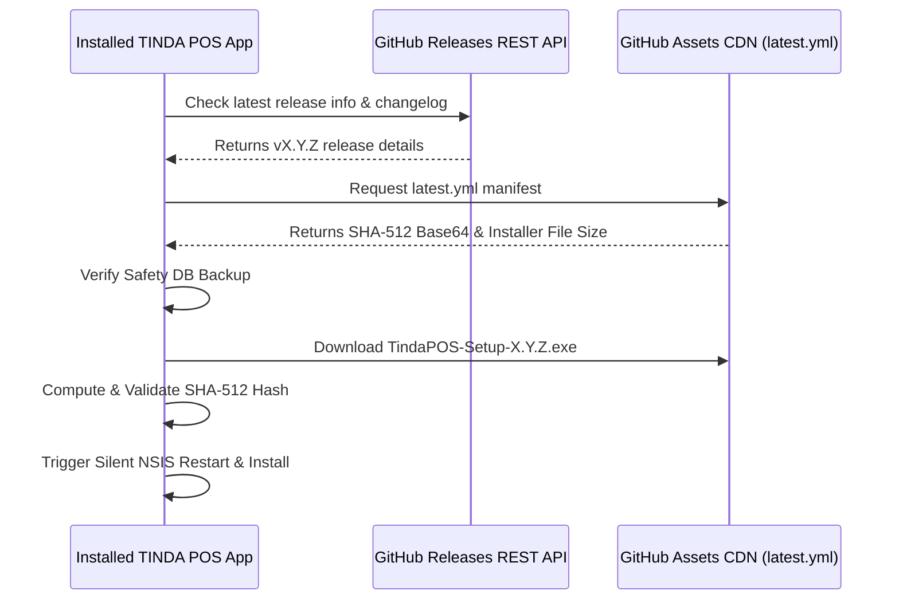

# TINDA POS — Master System Architecture & Engineering Standard

> **Document Version:** 1.0.0  
> **Classification:** Authoritative Technical Blueprint & System Specification  
> **Maintained by:** Lead Engineer & System Architect  
> **Last Updated:** 2026-09-25  

---

## 1. Executive Overview & Mission Statement

**TINDA POS** is an offline-first Point-of-Sale (POS) and inventory intelligence system tailored specifically for Philippine micro, small, and medium retail enterprises (sari-sari stores, grocery marts, and mini-supermarkets).

### Core Engineering Principles
1. **Absolute Offline Autonomy (Zero Cloud Lock-in):** Every critical operational loop—checkout, barcode scanning, cart updates, receipt printing, inventory deduction, credit tracking (utang), cash count, and shift closing (Z-Read)—must execute at 100% capacity with zero internet connectivity.
2. **Deterministic Financial Accuracy:** Floating-point math errors have zero tolerance. Every monetary unit is calculated and persisted in integer centavos (e.g. ₱10.50 = `1050`) or verified decimal bounds.
3. **Store Owner Authority (Sovereign Data):** Remote feeds (e.g. DTI SRP, Bantay Presyo market references) are strictly advisory. No cloud sync, background service, or remote API may ever mutate, overwrite, or delete store owner sales, inventory costs, or product retail prices without explicit owner confirmation.
4. **Crash-Proof Data Safety:** Power interruptions and sudden shutoffs are common in regional retail environments. The database must operate under Write-Ahead Logging (WAL) with strict transactional rollback protection.

---

## 2. Technology Stack & Process Architecture

```mermaid
graph TD
    subgraph Host OS [Windows 10 / 11 64-bit | Linux 64-bit]
        subgraph Electron Runtime [Electron Main Process - Node.js 22+]
            Updater[electron-updater & OTA Engine]
            DB[(Better-SQLite3 & Migrations)]
            Backup[Backup & Disaster Recovery Engine]
            IPCMain[Type-Safe IPC Handlers]
            Printer[Thermal Receipt Subsystem 58mm/80mm]
        end

        subgraph Chromium Window [Electron Renderer Process]
            UI[React 19 + Tailwind CSS + Lucide Icons]
            Store[Zustand State Stores]
            IPCRenderer[Window Electron Bridge API]
        end
    end

    IPCMain <==> |Structured IPC Bridge| IPCRenderer
    Updater --> |OTA Check / Updates| GH[(GitHub Official CDN / Releases)]
    DB <--> |Encrypted WAL Transactions| Storage[Local AppData Storage]
```

### Core Stack
* **Runtime Framework:** Electron (Node.js LTS + Chromium)
* **Build System:** `electron-vite` (Vite 8+ bundling)
* **Frontend Layer:** React 19, TypeScript 5.7+, Tailwind CSS 3.4
* **State Management:** Zustand (reactive local state stores)
* **Database Engine:** `better-sqlite3` (direct, synchronous, high-throughput C-binding SQLite driver)
* **Validation Layer:** Zod + React Hook Form
* **Update Engine:** `electron-updater` (NSIS Delta & Differential Auto-Update)
* **Market Harvester:** Python 3.14 + `d4vinci/Scrapling` (stealth DTI/Retail price harvester)

---

## 3. Data Integrity & Persistence Architecture

### 3.1 Database Configuration
* **Database File:** `%APPDATA%\TINDA POS\database\tindapos.db`
* **Journal Mode:** `PRAGMA journal_mode = WAL;` (Write-Ahead Logging ensures concurrent read performance and ACID compliance during crashes).
* **Synchronous Setting:** `PRAGMA synchronous = NORMAL;` (Safe balance between disk write latency and power-loss resilience).
* **Foreign Key Constraints:** `PRAGMA foreign_keys = ON;` (Strict referential integrity).

### 3.2 Financial Precision Rules
* All monetary values in the database are stored as **INTEGER centavos**:
  $$\text{Value in DB} = \text{PHP} \times 100$$
* All UI inputs formatting currencies must parse cleanly to integer centavos before hitting SQLite transactions.
* **Profit Calculation:**
  $$\text{Net Profit} = \sum (\text{Selling Price} - \text{Unit Cost}) - \text{Discounts} - \text{Refunds} - \text{Expenses}$$

### 3.3 Shift & Auditing Boundaries
* **X-Read:** Read-only snapshot of current shift totals; does not mutate database records or close the drawer.
* **Cash Count Gate:** Enforces physical bill/coin reconciliation before shift finalization.
* **Z-Read:** Immutable, cryptographic snapshot closing the active cashier shift. Once recorded, records cannot be modified or re-executed.

---

## 4. Hardware & Peripherals Specification

### 4.1 Thermal Receipt Printers
* **Protocols Supported:** Direct ESC/POS and standard Windows Printer Subsystem (Win32 Spooler via Electron `webContents.print`).
* **Supported Paper Widths:**
  * **80mm Standard:** Printable width $\approx 72\text{mm}$, 48 columns (monospace font).
  * **58mm Compact:** Printable width $\approx 48\text{mm}$, 32 columns.
* **Defensive Printing Gate:** Printing failures must **never** roll back or invalidate a completed sale. The transaction is saved first; receipts can be reprinted indefinitely from **Transaction History**.

### 4.2 Barcode Scanners
* Standard USB / Bluetooth HID POS Barcode Scanners (emulating rapid keyboard input terminating with `Enter` / `\n`).
* Input debounce buffer handles keyboard emulation vs manual barcode typing seamlessly.

---

## 5. OTA Update System & Release Engineering Standard

The software updater operates across two synchronized mechanisms:



### 5.1 Mandatory Release Asset Checklist
Every production release published to GitHub **MUST** include all 5 required artifacts:
1. `TindaPOS-Setup-X.Y.Z.exe` — Windows NSIS Installer executable
2. `TindaPOS-Portable-X.Y.Z.exe` — Standalone portable executable
3. `latest.yml` — **CRUCIAL**: `electron-updater` manifest containing:
   * `version: X.Y.Z`
   * `files[0].url`: exact setup filename
   * `files[0].sha512`: Base64-encoded SHA-512 hash of the Setup file
   * `files[0].size`: exact byte size of the Setup file
   * `releaseDate`: ISO-8601 UTC timestamp
4. `TindaPOS-User-Guide.pdf` — End-user manual generated for the specific release version.
5. `SHA256SUMS-vX.Y.Z.txt` — SHA-256 checksums of all binaries for security verification.

---

## 6. Engineering Quality Gates (CI/CD Local Standard)

Before any commit is promoted to `master` or built into release binaries, it must pass all 4 verification gates:

```bash
# 1. Code Quality & Formatting Gate
pnpm run lint          # Must return 0 errors, 0 warnings

# 2. Static Type Analysis Gate
pnpm run typecheck     # Must compile cleanly (tsc -b --noEmit)

# 3. Automated Regression & Unit Testing Gate
pnpm run test          # All unit, integration, and store tests must pass

# 4. Packaging Build Gate
pnpm run build         # Must produce clean production bundles
```

---

## 7. Disaster Recovery & Safety Protocols

1. **Pre-Update Safety Backup:** The app automatically takes a cold backup of `tindapos.db` into `%APPDATA%\TINDA POS\backups\pre-update\` before applying any binary patch.
2. **Universal Cross-Platform Backup (`.tinda-backup`):** Single-file JSON archive containing whole store schemas and datasets that can be transferred and restored seamlessly across Windows and Android editions.
3. **Database Reset Guard:** Destructive database resets require explicit administrative confirmation (typing `RESET` in capital letters) preceded by an automated fallback backup.
